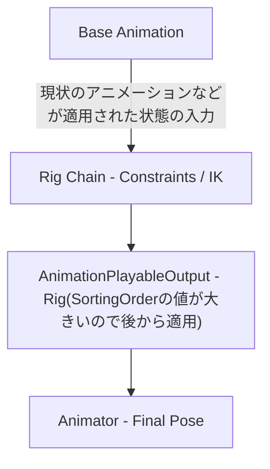

import LinkCard from '../../components/LinkCard.astro';
import VideoEmbed from '../../components/VideoEmbed.astro';

## 1. はじめに
今の制作の中で、PlayableとAnimationRiggingを組み合わせて使った際にうまくいかなかったことがあったのでまとめました。  
問題と解決方法だけを知りたい方はこちら → [併用の問題](#problem)


## 2. PlayableとAnimation Riggingに関して
- PlayableGraphの仕組み
- AnimationClipPlayable / AnimationLayerMixerPlayable の役割

すでに色々なサイトで紹介されているので省きます。自分は以下のサイト等を参考にしました。

Playable  
<LinkCard url="https://docs.unity3d.com/ja/2022.3/Manual/Playables.html" />
<LinkCard url="https://zenn.dev/allways/articles/5b9ef33032d5fa" />
<LinkCard url="https://shibuya24.info/entry/unity-playable-start" />
AnimationRiggin  
<VideoEmbed src="https://www.youtube.com/watch?v=pml41GD8Ub4" />

## 3.AnimatorとPlayableどっちがいいのか
今回初めてがっつりPlayableを触って考えたのですが、モーションが膨大になったり遷移条件が複雑になってくるならPlayableを使ってもイイかなと思いました。  
回りでは、Animatorはすぐ複雑になるからよくない！みたいな意見を聞くこともあるのですが、以下の動画の通りにやれば大体は解決するのではないかなと思っています。

<VideoEmbed src="https://youtu.be/eEm0TmfCGFU" />

ただ、Playableのメリットとして  
「コード上で管理できてわかりやすい」  
「animationの待機や現在のアニメーションの取得、ブレンドなどを手軽にできる」  
のはAnimatorにない良さかなと思いました。  
リッチなアニメーションのゲームを作るには、こちらを使った方がいいような気がします。

## 4. 問題 {#problem}
本題です。
「併用するとRiggingのTargetやhintが動かせない」という問題が起きました。

## 5. 原因と対処
- RigをPlayableGraphに接続していなかった
- TargetとHintをキャラモデル直下においていた  

が原因でした。

### RigをPlayableGraphに接続していなかった
紹介されているものの多くがAnimatorの使用を前提として動いており、コード上でRigに対してなにかをしていなかったので気づけませんでした。  
PlayableGraphで動かす際は使用前に  
 
```c#
_rigBuilder.Build(_graph);  //指定したグラフにRigBuilderを適用する
```

グラフの更新前に
```c#
_rigBuilder.SyncLayers();　//変更した重みなどを適用する
```
を呼ぶ必要があります。

### TargetとHintをキャラモデル直下においていた
紹介動画の多くでは、RigSetup実行後のRigオブジェクト直下にTargetやHintを置いていたのでそれにならって配置していました。
Playableの場合、Animatorのあるオブジェクトの子にすると座標が制御されてしまい操作できなくなってしまいます。
自分はTargetとHintをAnimator直下からだすことでこれを回避しました。

### 最終的な処理の実行順




## 6. まとめ
- PlayableGraphにRigを接続しよう
- ターゲットはAnimatorの影響を受けない場所に配置しよう

## 7. 終わりに
今回作成したPlayableを使用したコードの全体を張っておきます。
アドバイス等貰えるとありがたいです。
<LinkCard url="https://gist.github.com/TsuyoshiUsugi/4d46362c72e0b4bfb2fda8ae7444d2df" />